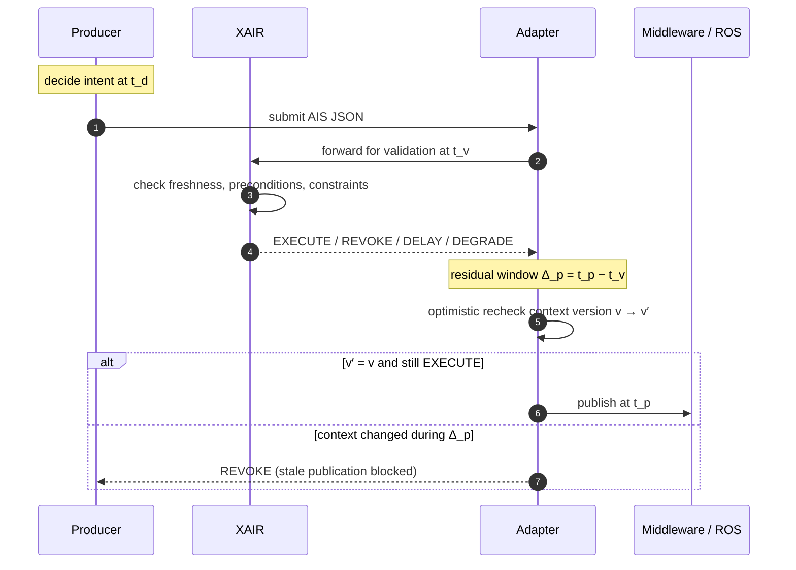
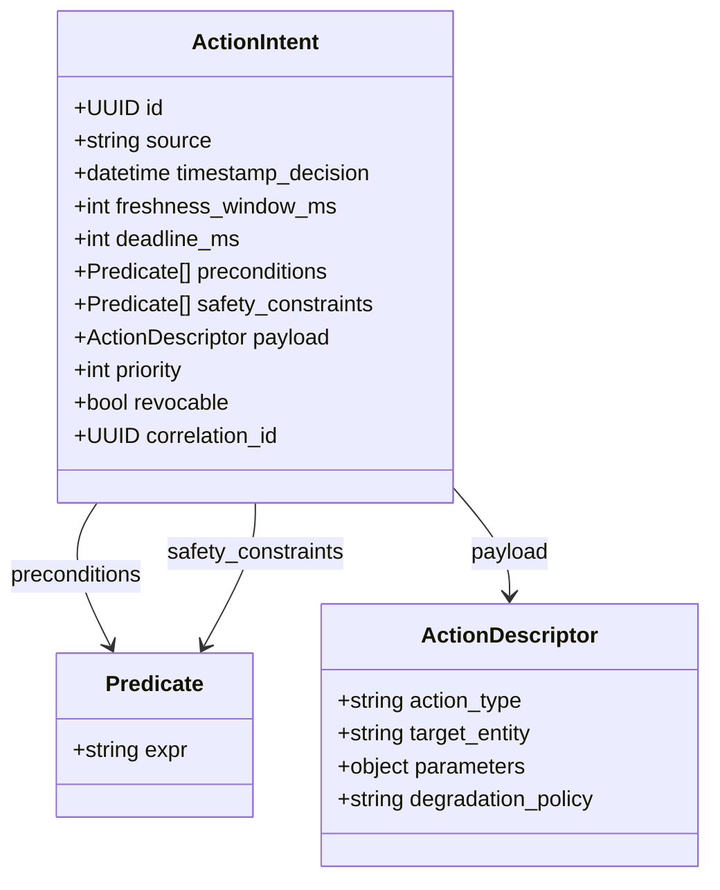
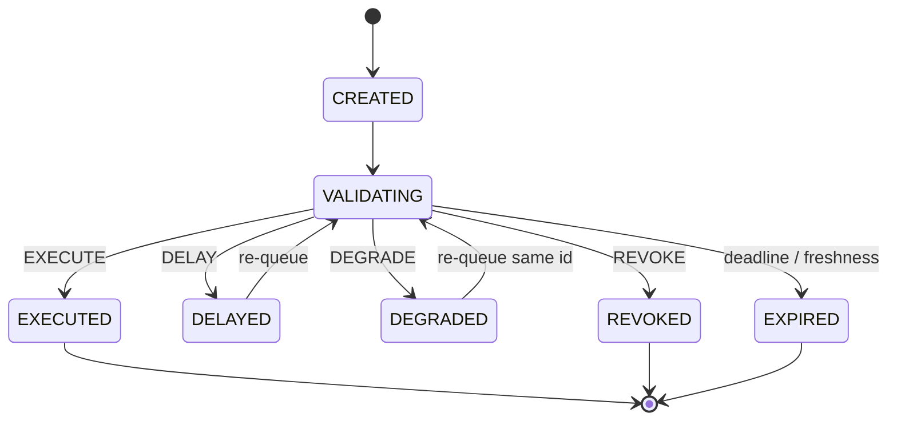
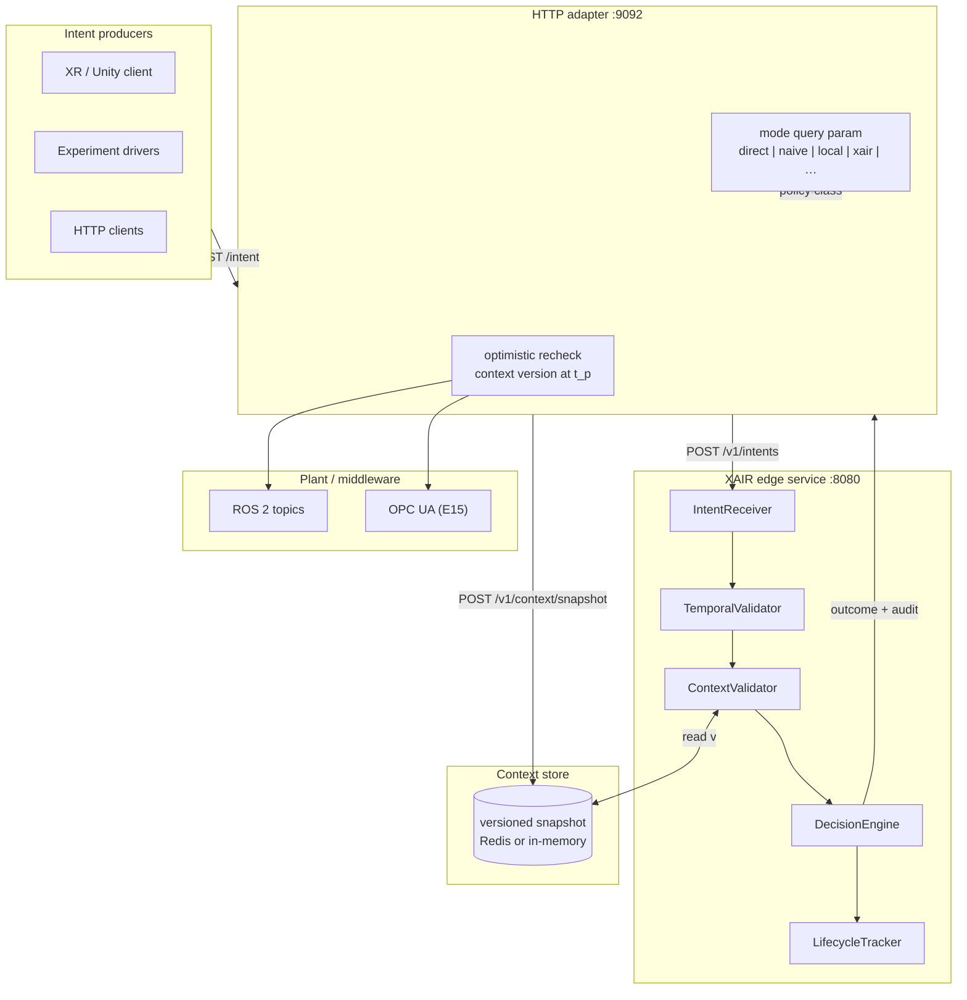
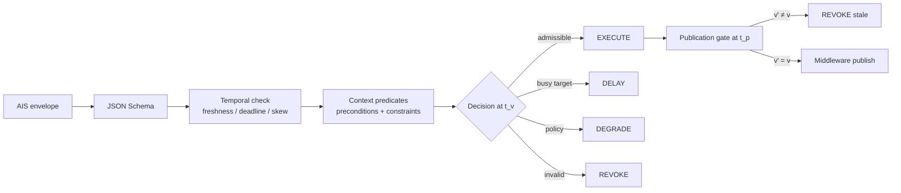
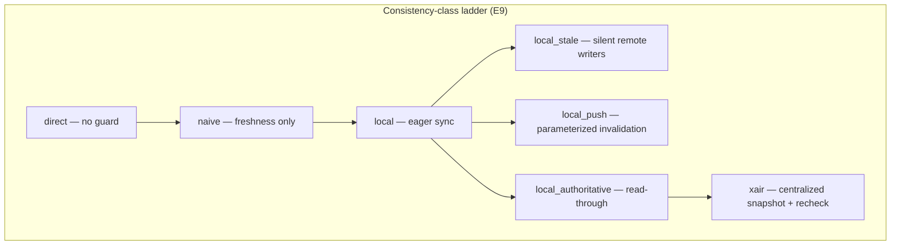
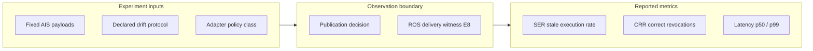

# XAIR — eXecution-time Action Intent Runtime

Reference implementation and reproducible evaluation harness for **execution-time validation** of context-carrying **Action Intents (AIS)** in industrial cyber-physical systems (CPS).

Companion paper: *Execution-Time Validation of Context-Carrying Action Intents in Industrial CPS* (IEEE Transactions on Industrial Informatics, under review).

---

## What problem does XAIR address?

In AI-enabled manufacturing cells, XR remote-control sessions, and vision pipelines, a command can be **decided** at time \(t_d\) but **published** to middleware only at \(t_p\). Plant context (line state, gripper status, safety zone) may change in between. Middleware that publishes without re-checking context can cause **stale actuation**: the command was valid when chosen but obsolete when released.

XAIR implements a **publication-boundary gate** that:

1. validates each intent at **validation time** \(t_v\) against a versioned context snapshot;
2. performs an **optimistic context-version recheck** immediately before publication at \(t_p\);
3. records every outcome (EXECUTE / REVOKE / DELAY / DEGRADE) with reason codes for audit.

XAIR does **not** replace safety-rated PLCs or formal runtime enforcers. It governs **semantic admissibility** of discrete, schema-valid intents from heterogeneous producers before they reach ROS 2, OPC UA, or similar transports.

### Execution gap (timeline)



---

## What is in this repository?

| Component | Path | Description |
|-----------|------|-------------|
| **AIS schema** | `schemas/action-intent-v1.json` | JSON Schema for context-carrying intents (preconditions, freshness, deadline, action descriptor) |
| **Core runtime** | `xair/core/` | Reception, temporal/context validation, lifecycle FSM, decision engine |
| **HTTP service** | `xair/adapters/http_server.py` | FastAPI ingress (`POST /v1/intents`, context snapshots, metrics) |
| **Unit & HTTP tests** | `tests/` | Pytest suite (schema, FSM, idempotency, temporal revoke, HTTP e2e) |
| **Experiment drivers** | `experiments/run_e*.py` | Suites **E0–E15** used in the TII paper |
| **Canonical results** | `experiments/results/` | CSV/JSON traces shipped with the paper (regenerable) |
| **Aggregation & plots** | `experiments/aggregate_*.py`, `plot_results.py` | Recompute SER/CRR/latency and regenerate figures |
| **Stack scripts** | `scripts/` | Start Redis + XAIR + HTTP adapter, full paper campaign, smoke verify |
| **Simulation** | `simulation/` | Gazebo industrial cell (E8), OPC UA HIL context writer (E15) |
| **CI** | `.github/workflows/ci.yml` | Pytest, quick integration runs, clean-clone audit |

### AIS schema (`schemas/action-intent-v1.json`)



Sources: `cv` · `ai` · `xr` · `human` · `composite` — see [`examples/`](examples/) for sample payloads.

### Intent lifecycle (audit FSM)



---

## Architecture (high level)



### Internal validation pipeline



**Adapter modes** (evaluated symmetrically over the same HTTP path):



| Mode | Behavior |
|------|----------|
| `direct` | No validation; always publishes |
| `naive` | Freshness/deadline only; ignores context |
| `local` | Co-located guard with eager context sync |
| `local_stale` | Local cache without refresh (negative control) |
| `local_push` | Push-notified cache invalidation (parameterized) |
| `local_authoritative` | Read-through to authoritative snapshot |
| `xair` | Centralized validation + optimistic recheck at t_p |

---

## Installation

**Requirements:** Python 3.12+, Linux (Ubuntu 24.04 tested). Optional: Docker (Redis), ROS 2 Jazzy + Gazebo (E8), OPC UA stack (E15).

```bash
git clone https://github.com/lucadagati/XAIR_eXecution-time_Action_Intent_Runtime.git
cd XAIR_eXecution-time_Action_Intent_Runtime

python3 -m venv .venv
source .venv/bin/activate   # Windows: .venv\Scripts\activate
pip install -e ".[dev]"
```

The `[dev]` extra installs pytest, httpx, matplotlib, and asyncua.

---

## Quick verification

```bash
# 1) Unit tests + lifecycle regression (E0)
pytest tests/ -v
python experiments/run_e0_lifecycle.py

# 2) Start stack: Redis (optional) + XAIR :8080 + adapter :9092
./scripts/start_full_stack.sh
./scripts/verify_e2e.sh

# 3) Short baseline run (5 trials)
python experiments/run_e1_baselines.py --runs 5 --seed 1 --baselines xair direct
```

Stop services with `./scripts/stop_full_stack.sh`.

---

## Evaluation suites (E0–E15)

Detailed protocol notes: [`experiments/EVALUATION.md`](experiments/EVALUATION.md). Step-by-step reproduction: [`REPRODUCE.md`](REPRODUCE.md).

| Suite | Script | What it measures |
|-------|--------|------------------|
| **E0** | `run_e0_lifecycle.py` | Intent lifecycle transitions (execute, revoke, delay, degrade, expire) |
| **E1** | `run_e1_baselines.py` | Stale RESUME under context drift; SER across adapter modes |
| **E3** | `run_e3_http_stack.py` | Multi-producer resource conflict (AI vs XR) via the batch endpoint |
| **E4** | `run_e4_http_load.py` | Throughput and internal vs end-to-end latency (10k intents) |
| **E6** | `run_e6_network.py` | Real `tc netem` delay/jitter/loss impairment (`--use-netem`) |
| **E8** | `run_e8_gazebo_cell.py` | Coherent-cache cell scenario + ROS delivery witness |
| **E9** | `run_e9_consistency_sweep.py` | Cache-coherence class sweep (delay × policy heatmap) |
| **E10** | `run_e10_toctou.py` | Validate-to-publish window under induced publish delay |
| **E11** | `run_e11_stratified.py` | Mixed valid/drifted stochastic trials |
| **E12** | `run_e12_scaling.py` | Producer concurrency vs latency under lock contention |
| **E13** | `run_e13_faults.py` | Ingress faults: malformed JSON, duplicates, clock skew |
| **E14** | `run_e14_variants.py` | Action-type diversity |
| **E15** | `run_e15_opcua_hil.py` | OPC UA line-state writes into shared snapshot |

### Full paper campaign

Regenerates all canonical CSV/JSON under `experiments/results/` (overwrites shipped traces):

```bash
./scripts/run_paper_campaign.sh
python experiments/aggregate_experiment_results.py
python experiments/plot_results.py --out experiments/plots
```

A non-destructive smoke test that writes to `/tmp` is available:

```bash
./scripts/verify_reproduction.sh
```

### Shipped results

The repository includes the result traces used to produce the paper tables and figures (`experiments/results/*.csv`, `paper_metrics_summary.json`). Independent replication should **verify ground-truth labels** in those files before comparing numeric tolerances across hardware.

---

## Key metrics

- **SER** (Stale Execution Rate): authorized publication when context was invalid at observation time
- **CRR** (Correct Revocation Rate): revokes that match ground-truth drift labels
- **FPR** (False Positive Revocation): valid intents wrongly revoked
- **Latency**: internal validation (XAIR hot path) vs end-to-end (HTTP ingress through adapter publication)

Ground truth is declared per suite (drift schedule, injection protocol, or explicit pass criteria) — not inferred post hoc from logs.



---

## Optional: Gazebo cell (E8)

```bash
./scripts/setup_gazebo.sh          # once: ROS 2 Jazzy + Gazebo Harmonic
./scripts/start_full_stack.sh
./scripts/start_gazebo_cell.sh
python experiments/run_e8_gazebo_cell.py --runs 30 --use-gazebo
```

See [`simulation/industrial_cell/README.md`](simulation/industrial_cell/README.md).

---

## Docker / Redis

```bash
docker compose up -d redis    # optional shared context store
uvicorn xair.adapters.http_server:app --host 0.0.0.0 --port 8080
```

Configuration: [`config.yaml`](config.yaml), environment variables `REDIS_URL`, `XAIR_URL`.

---

## Citation

```bibtex
@software{xair_runtime_2026,
  author  = {D'Agati, Luca and Tricomi, Giuseppe and Mirto, Fabio Orazio and Merlino, Giovanni},
  title   = {{XAIR Runtime: Execution-Time Validation for Industrial CPS}},
  year    = {2026},
  url     = {https://github.com/lucadagati/XAIR_eXecution-time_Action_Intent_Runtime},
  version = {0.1.1a1}
}
```

See also [`CITATION.cff`](CITATION.cff) for machine-readable citation metadata.

---

## License

Apache-2.0 — see [`LICENSE`](LICENSE).

---

## Related documentation

- [`REPRODUCE.md`](REPRODUCE.md) — environment setup, suite commands, tested versions
- [`experiments/EVALUATION.md`](experiments/EVALUATION.md) — baselines, scenario E1b, metric definitions
- [`examples/`](examples/) — sample AIS JSON payloads
