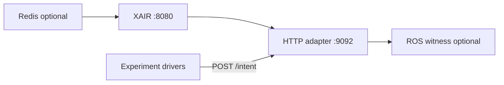

# Reproducing XAIR Evaluation (E0–E15)

## Requirements

- Ubuntu 24.04 (or compatible Linux)
- Python 3.12+
- Docker (optional, Redis)
- Optional: ROS 2 Jazzy + Gazebo Harmonic for E8
- Optional: OPC UA local server for E15 (`asyncua` in `[dev]` extra)

## Environment

```bash
python3 -m venv .venv
.venv/bin/pip install -e ".[dev]"
```

## One-command stack

```bash
./scripts/start_full_stack.sh
./scripts/verify_e2e.sh
```



Starts Redis (if Docker available), XAIR on `:8080`, HTTP adapter on `:9092`, and ROS audit subscriber when ROS 2 is sourced.

## Full paper campaign

```bash
./scripts/run_paper_campaign.sh
.venv/bin/python experiments/aggregate_experiment_results.py
.venv/bin/python experiments/plot_results.py --out experiments/plots
```

Raw outputs land in `experiments/results/*.csv` and `experiments/results/paper_metrics_summary.json`.

## Suite reference

| Suite | Driver | Purpose |
|-------|--------|---------|
| E0 | `run_e0_lifecycle.py` | Intent lifecycle transitions |
| E1 | `run_e1_baselines.py` | Stale RESUME baselines (direct/naive/local/xair) |
| E4 | `run_e4_http_load.py` | Load latency (10k intents) |
| E8 | `run_e8_gazebo_cell.py` | Coherent-cache cell + ROS witness |
| E9 | `run_e9_consistency_sweep.py` | Cache-coherence class sweep |
| E10 | `run_e10_toctou.py` | TOCTOU window under induced publish delay |
| E11 | `run_e11_stratified.py` | Mixed valid/drifted stochastic trials |
| E12 | `run_e12_scaling.py` | Producer concurrency scaling |
| E13 | `run_e13_faults.py` | Ingress fault pass criteria |
| E14 | `run_e14_variants.py` | Action-type diversity |
| E15 | `run_e15_opcua_hil.py` | OPC UA context-write path |

## Gazebo (E8)

```bash
./scripts/setup_gazebo.sh
./scripts/start_full_stack.sh
./scripts/start_gazebo_cell.sh
.venv/bin/python experiments/run_e8_gazebo_cell.py --runs 30 --use-gazebo
```

## Measurement integrity

Publication-boundary outcomes are scored at the HTTP/ROS adapter. E8/E9 optionally corroborate with an independent ROS 2 subscriber (`scripts/ros_audit_subscriber.py`). Aggregated summaries report witness agreement when ROS is available.

## Smoke verification (non-destructive)

```bash
./scripts/verify_reproduction.sh
```

Writes temporary results under `/tmp/xair-verify-results` without overwriting canonical paper CSVs.

## Tested versions

| Component | Version |
|-----------|---------|
| OS | Ubuntu 24.04 |
| Python | 3.12 |
| ROS 2 | Jazzy (optional) |
| Redis | 7-alpine (Docker) |
