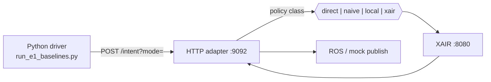
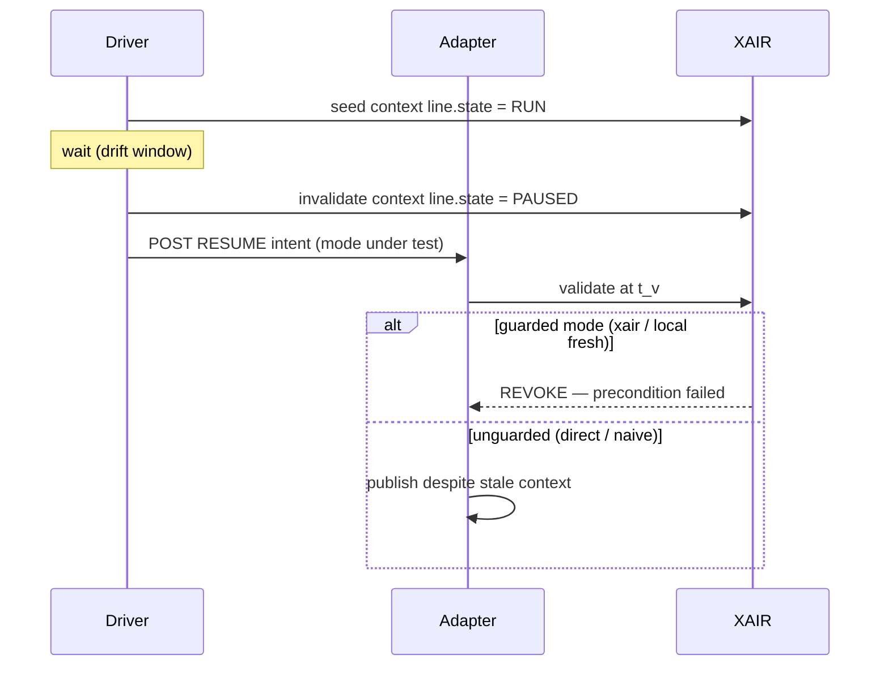

# Evaluation methodology (IEEE TII)

## Client path: HTTP protocol replay (Path B)

Primary evaluation uses **HTTP protocol replay** via `run_e1_baselines.py` — identical AIS JSON to the Unity `DefectEventEmitter` client. Unity Editor Play Mode is supported as optional replication when exported with a `_unity` suffix.



## Symmetric baselines

All baselines use the same HTTP path (`POST :9092/intent?mode=`):

| Mode | Behavior |
|------|----------|
| `xair` | Full temporal + contextual validation via XAIR |
| `naive` | Freshness window only; ignores context |
| `direct` | No validation; always publishes to ROS |
| `local` | Co-located guard with eager context sync |
| `local_stale` | Intentionally stale local cache (negative control) |

## Scenario E1b

Stale **RESUME** when line is **PAUSED** and gripper **CLOSED** — precondition `line.state == 'RUN'` fails at validation time.



Protocol order (aligned Unity + Python): **RUN → delay → context change → submit intent**.

## Metrics

- **SER** = stale_executed / attempted (ros_published when context invalid)
- **SER_known** (E8) = stale_executed / completed runs (excludes UNKNOWN transport failures)
- **POA** = correct_revokes / obsolete_intents (excludes UNKNOWN)
- **FPR** = wrongful_revokes / valid_intents (E1c)
- **CV** = conflict violations (E3)
- **UR** = unknown_rate

## Reproduce

```bash
./scripts/start_full_stack.sh
./scripts/verify_e2e.sh
python experiments/run_e1_baselines.py --runs 30 --seed 42
python experiments/run_e1_fpr.py --runs 30
python experiments/run_e3_http_stack.py --runs 30
python experiments/run_e4_http_load.py --intents 1000
python experiments/aggregate_experiment_results.py
python experiments/plot_results.py --out experiments/plots
```
