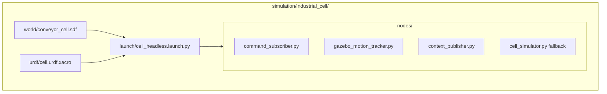
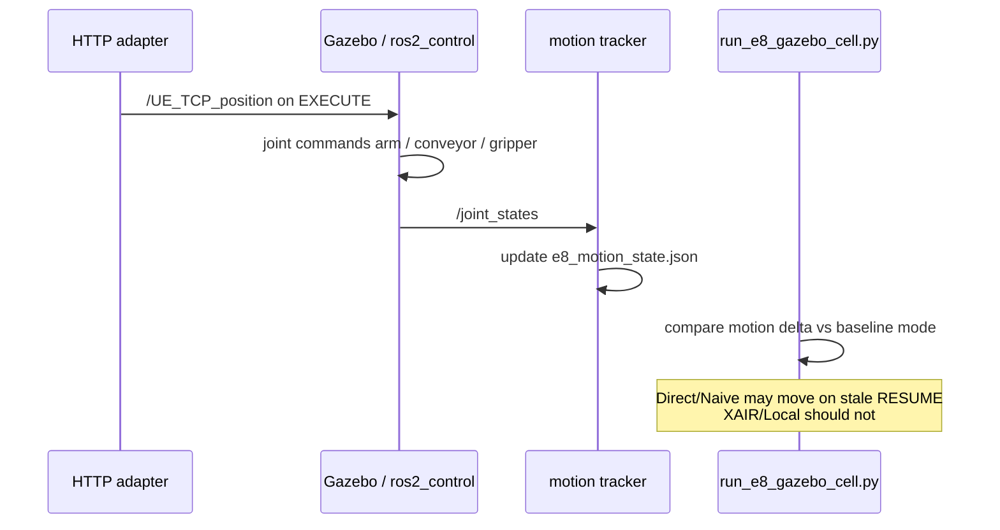

# Industrial Cell — Gazebo Harmonic (Headless)

Manufacturing cell simulation for E8 motion proof: conveyor + TCP slide + gripper, controlled via the same ROS topics as the AdaptiX adapter.

## Layout



## Context loop (E8)



## Prerequisites

Ubuntu 24.04 + ROS 2 Jazzy + Gazebo Harmonic:

```bash
cd adaptix/scripts && ./setup_gazebo.sh
```

## Quick start (full E8 with Gazebo)

```bash
# Terminal 1: HTTP/ROS stack
cd adaptix/scripts && ./start_full_stack.sh

# Terminal 2: Gazebo Harmonic headless + ros2_control
cd adaptix/scripts && ./start_gazebo_cell.sh
# or: ros2 launch XAIR_Runtime/simulation/industrial_cell/launch/cell_headless.launch.py

# Terminal 3: E8 with Gazebo joint motion proof
cd adaptix/XAIR_Runtime
.venv/bin/python experiments/run_e8_gazebo_cell.py --runs 30 --use-gazebo
```

## Fallback (ROS topics only, no Gazebo)

```bash
python3 simulation/industrial_cell/nodes/cell_simulator.py &
python experiments/run_e8_gazebo_cell.py --runs 30
```

## Context loop

1. Adapter publishes `/UE_TCP_position` and `/UE_Gripper_angles` on EXECUTE.
2. `command_subscriber` maps pose → `cell_position_controller` (arm, conveyor, gripper).
3. `gazebo_motion_tracker` increments `motion_count` when joints move.
4. E8 compares motion delta: Direct/Naive should move; XAIR/Local should not on stale RESUME.

(See sequence diagram above.)

## Verify

```bash
source /opt/ros/jazzy/setup.bash
ros2 topic list | grep -E 'joint_states|UE_TCP'
ros2 topic echo /joint_states --once
cat experiments/results/e8_motion_state.json
```
